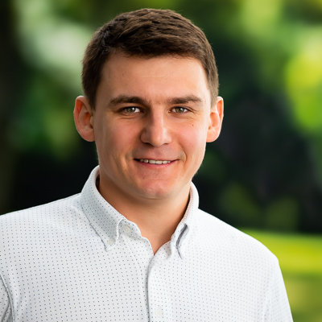

<figure>
  
</figure>

I am passionate about solving complex challenges and delivering results, no matter the field. Currently, I serve as a software engineer at Meta, where I focus on scaling the training of machine learning models. Previously, I [led a team dedicated to scaling a machine learning prototype for production-level particle physics simulations](https://community.intel.com/t5/Blogs/Products-and-Solutions/HPC/Hands-On-with-Intel-at-Exascale/post/1517389). My experience also includes [contributing to the development of deep learning frameworks for the supercomputer Aurora](https://newsroom.intel.com/artificial-intelligence/aurora-supercomputer-ranks-fastest-for-ai) and creating [expressive machine learning models for particle physics simulations](https://news.mit.edu/2020/provably-exact-artificial-intelligence-nuclear-particle-physics-0924). I hold a PhD in Theoretical Physics and [have a keen interest in sailing racing](https://rhodes19.org/racing/national-champions/). I welcome connections, and LinkedIn is the best platform to reach me.
